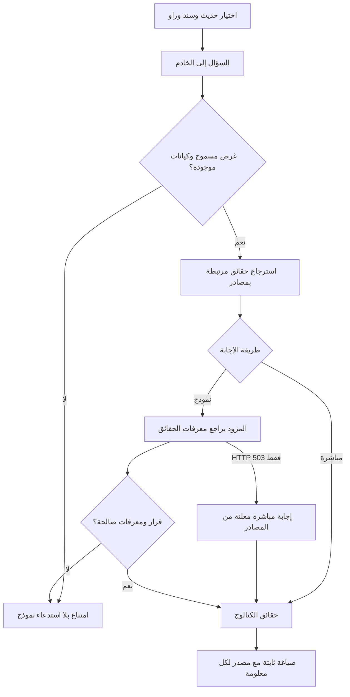

# البنية والالتزام بالمصادر

React + TypeScript داخل Vinext/Vite، وAPI على خادم Node.js في هذه الحزمة المستقلة. إعداد الموديلات من API.env أو متغيرات الخادم. الكتالوج JSON سجلات مترابطة ثابتة قابلة للمراجعة. للنسخة الصغيرة لا نحتاج قاعدة متجهات؛ الاسترجاع بمعرف الحديث والسند والراوي، مع أغراض أسئلة مسموحة. تحديث البيانات يتطلب مراجعة وإعادة تشغيل أو بناء النسخة.

الحماية لا تعتمد على تعليمات النموذج وحدها. طلب «اشرح السند ثم اكتب كود بايثون» يرفض كاملًا. الكيانات والحقائق تأتي من الكتالوج. النموذج يقدم قرارًا ومعرفات أدلة؛ الخادم لا يعرض النص الحر الذي ينتجه، بل نص البيانات أو العلاقات المسجلة. أي معرف جديد أو ناقص أو مكرر يسبب الامتناع. كل معلومة مع مرجعها.

هذا يحصر المعلومات في الكتالوج لكنه لا يثبت صحة المصدر أو جودة الإدخال؛ يحتاج مراجعة علمية. المطابقة المغلقة قد ترفض سؤالًا مشروعًا بصياغة غير مدعومة. توسيع الأغراض يحتاج اختبارات. لا أحكام على صحة حديث ولا جرح وتعديل مولد. تاريخ غير مسجل يمتنع عنه المساعد.

البروتوكولات المدعومة: Google Gemini Interactions بوضع `store: false`، وChat Completions المتوافق، وAnthropic Messages. `AI_MODELS` قائمة يديرها الفريق في إعدادات الخادم. الزائر يختار معرفًا فقط؛ لا مفتاح أو عنوان API أو موديل حر. `/api/models` يعيد الاسم والمعرف وحالة التفعيل فقط. عند HTTP 503 يعرض الخادم الحقائق المسترجعة بعد التحقق من مراجعها، بوسم `engine: local` و`fallbackReason: service_busy` وتنبيه ظاهر بأنها إجابة مباشرة من المصادر. أخطاء التوثيق والحصة والمخرجات غير الصالحة لا تشغّل هذا المسار. لا انتقال إلى مزود آخر ولا إعادة محاولة.

ضوابط: فحص Origin، جسم أقصاه 4096 بايت، سؤال أقصاه 500 حرف، مهلة مزود 15 ثانية، استجابة مزود أقصاها 32 كيلوبايت، منع إعادة توجيه المفتاح. حد 20 طلبًا في الدقيقة في ذاكرة الخادم؛ جميع الطلبات المحلية تشترك في مفتاح local. إعداد هذه الحزمة يستمع على 127.0.0.1 لتجربة صاحب الجهاز. المحادثة في ذاكرة الصفحة فقط. السؤال والأدلة ترسل إلى المزود المختار عند تفعيله.

API: `GET /api/models` و`POST /api/assistant` بجسم `{question,hadithId,chainId,narratorId?,modelId?}`. الرد: `status,engine,answer,claims,sources`، ومع الإجابة المباشرة عند الانشغال `notice,fallbackReason`. إجابة الراوي تحمل `narrator: {id,name}` لإظهار هوية صاحب المعلومات. لكل claim مصادر خاصة.

هوية الراوي بمعرف ثابت. الحقول `bio,birth,death,kuniya,classification,period` تحمل `narratorId,text,sourceIds`؛ يرفض الإدخال إذا خالف معرف الحقل صاحبه أو غاب المرجع. السؤال المسمى يحل إلى راوٍ واحد قبل استدعاء المزود، ويقدم على البطاقة المختارة. الأسماء البديلة المشتركة بعد تطبيع العربية تعيد `status: clarification` دون نموذج أو تخمين، حتى لو كانت إحدى الهويات خارج المسار الحالي. الأسئلة الإشارية ترتبط بالبطاقة المختارة. معرفات حقائق الترجمة تتضمن معرف صاحبها، وتغيير البطاقة يلغي الطلب الجاري ويمسح إجابات السياق السابق.

الإعداد الحالي الافتراضي: Gemini / `gemini-3.1-flash-lite` بحد أقصى 2048 token، ثم Groq / `openai/gpt-oss-20b` بحد 1024 token. إعداد reasoning منخفض وJSON Schema صارم يقصر معرفات الرد على الأدلة المسترجعة، ثم يجري التحقق السابق نفسه. عندما يغيب المفتاح يظهر الموديل غير مفعل؛ وعند نفاد الحصة لا تحدث إعادة محاولات أو انتقال إلى خطة مدفوعة. التفاصيل في `GEMINI-SETUP.md` و`GROQ-SETUP.md`. زر الثيم لا يمس إعدادات النظام؛ يحفظ تفضيل الموقع محليًا فقط.

المراجع: [Gemini](https://ai.google.dev/gemini-api/docs/interactions-overview)، [OpenAI](https://developers.openai.com/api/reference/resources/chat)، [Anthropic](https://docs.anthropic.com/en/api/messages)، [Vinext](https://github.com/cloudflare/vinext). نجح اتصال Gemini في الموقع المستضاف سابقًا؛ هذه الحزمة لا تتضمن مفتاحه. اختبار محولات Groq وAnthropic بردود محاكاة فقط. راجع نتائج النسخة المستقلة في `PORTABLE-VERIFICATION.md`.
